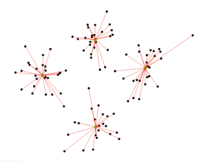
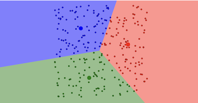

## Unit 5: Wiki Activity: K-Means Clustering

After watching the animations of the clustering algorithms, I found it fascinating to see how they behaved. 

In the [first animation](http://shabal.in/visuals/kmeans/6.html), with 4 centroids selected at the top, right, bottom, or left, the algorithm ended up with clear clusters. It was interesting to watch how it grouped similar points based on their proximity and also have the centroids updated.  The assignment and update steps were repeated until meaningful clusters were formed.

In the [second animation](https://www.naftaliharris.com/blog/visualizing-k-means-clustering/), I selected "Uniform Points" and chose three centroids that were very close to each other. I could see the clustering process unfold as I clicked on the "Reassign Points" and "Update Centroids" buttons. The algorithm continued refining the clusters until it reached convergence, meaning there were no significant changes in cluster assignments. I noticed how challenging it became for the algorithm to identify meaningful clusters in this scenario. It was fascinating to see how k-means clustering works and how different starting positions for the centroids can change the results.

